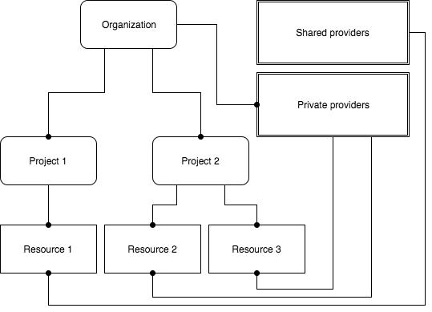

# Self-Service User Guide

## Overview
ETAIS self-service portal is a single entry point for provisioning and managing computational and storage resources
shared by ETAIS consortium members - UT, TTU, NICPB and HITSA - as well as public cloud providers. It is aimed at
research groups affiliated with Estonian research and development institutions from both public and private sector.

Self-service portal offers research groups a way to collaborate on using and sharing research infrastructure to
minimise bureaucracy of negotiating access, quotas and payments.

The main concepts are as follows:

* **Organization** is a standalone entity that represents a research group or a company. Organization is responsible for the 
actions of users connected to it in different [roles](#roles).
* **Project** is an entity within an organization that aggregates and isolates teams and resources.
* **Provider** is an entity that represents account in an external service provider.
  * **Private providers** - providers that are available and manageable within a specific organization.
  * **Shared providers** - global providers that are available for all organizations. This includes HPC, cloud and storage infrastructure from ETAIS consortium.
* **Resource** - an entity within a project and a provider. Represents cloud resource. Examples: virtual machine or volume in OpenStack, quota in batch processing queue.

ETAIS self-service portal is based on [Waldur](https://waldur.com) cloud brokerage platform. The latest documentation is available from
[docs.waldur.com](http://docs.waldur.com). Below are key aspects adapted for ETAIS deployment.

### Workspaces
ETAIS self-service is built around the concept of workspaces. Workspace defines structural context for the 
user. Each workspace type shows information and possible actions relevant to the user in a certain role.
There are several workspace types available in the system:

* [Organization workspace](#organization workspace)
* [Project workspace](#project workspace)
* [User workspace](#user workspace)

### Roles
Users are connected to the organizations and their projects through roles. Users may have several roles, specific to each workspace they have been credited access to. Currently the following roles are available in the system:

* Organization owners (owners)
* Project managers (managers)
* System administrators (admins)

User roles are hierarchical in a way that organization owners can do everything that project managers and system administrators can do.

#### Organization Owners
* Can access organization workspace.
* Can invite other users to participate in the organization.
* Can create and manage projects, including policies and cost limitations.
* Can manage resource providers and set their availability within projects.
* Can do everything that project managers and system administrators can do.

#### Project Managers
* Can access project workspace when appointed by organization owner.
* Can manage project team from the users already connected to the organization.
* Can do everything that system administrators can do.

#### System Administrators
* Can access project workspace if appointed by organization owner or project manager.
* Can provision resources from Service Store within limits set by organization owner.
* Can manage provisioned cloud resources.
  
### Service Store

Service Store provides a common way to provision resources from both shared and private service providers.

The following resource types are offered at the moment:

* Virtual Private Cloud (VPC) - a pool of resources dedicated to a particular organization.
* Virtual Machines (requires pre-provisioned VPC) - a server with network connectivity for running customer payloads.
* Block Devices (requires pre-provisioned VPC) - persistent volumes for storage of the data.
* Batch (TBD) - access to Slurm-based processing farms.

#### VPC Details
* Virtual Private Cloud aka VPC is a compute service that allows to procure and manage a pool of virtualized infrastructure
resources - like RAM, CPU, storage volumes and network resources - required to run virtual machines.
* VPC package does not limit VM count - it depends on VM flavors used and total resources available in a chosen package.
* VPC packages can be upgraded and downgraded at any moment.
* VPC packages are accounted daily based on the price of the largest resource package that was selected during the day.

## Accounts

ETAIS self-service portal supports user accounts coming from [TaaT](http://taat.edu.ee) federated identity system,
which allows to use home organisation accounts for login. Most of the larger education and research institutions in
Estonia are connected to TaaT already.

Alternatively, one can login using account from [eduGAIN](https://www.geant.org/Services/Trust_identity_and_security/eduGAIN).

Self-Service Portal is available from: [https://minu.etais.ee](https://minu.etais.ee)

> *Users need to accept Terms of Service presented on the first login for account activation!*

## User workspace
User workspace is a personal account profile management space, presented after first login. It allows to configure user notifications, SSH public keys, update personal profile data, etc. 

Menu entries available within user workspace:

* **Dashboard**: listing all organizations and their projects where user is participating, in appointed roles
* **Audit logs**: listing events related to user
* **SSH keys**: managing public SSH keys for the user
* **Notifications**: managing notifications for the user
* **Manage**: editing and updating user profile details

### Accessing user workspace

Access is done by clicking on user avatar and selecting one of the entries from a pop-up menu.

## Organization and project workspace selector
Navigation between different organization and project workspaces are done with the help of the workspace selector available in the header row.

### Selecting organization workspace

### Selecting project workspace

## Organization workspace
Organization workspace allows to manage projects, subscriptions to resource providers and organization members. It is also intended to provide summary, accounting and auditing information regarding organization, projects and providers. To be able to access organization workspace, you need to have a organization owner role.

Menu entries available within organization workspace:

* **Dashboard**: overview of managed resources and projects
* **Providers**: resource providers management (system and provisioned providers)
* **Projects**: projects management
* **Service store**: catalog of resources and providers, available for provisioning 
* **Analytics**: resource usage reports
* **Audit logs**: event logs related to organization, its projects and resources
* **Team**: management of organization members and their project/role accreditations
* **Accounting**: resource usage accounting information
* **Manage**: management of organization details

### Adding a project
Projects can be added by selecting "Projects" from the menu and clicking on "Add project" button. 

"Create project" form requires you to enter project name and optionally project description. If you need to attach security class label for the project you should select one from the list presented. Submit form by clicking on "Add project" button.

### Inviting and accrediting users
User workspace access and role management can be done on two separate levels:

* Organization workspace allows owners to invite and accredit users as organization members and to manage their project/role assignment(s)
* Project workspace allows project managers to select users from available organization members into project team and to assign a project role 

Organization invites can be created by selecting "Team" from the organization workspace menu and clicking on "Invitations" management tab.

For creating a new invitation please click on "Invite user" button.

> *NB! By sending an invite to a user you also accredit this user to become an organization member! In order to complete the joining process target user needs to login with the URL provided in the invitation.*  

"Invite user" form requires target user email address, initial project and role selection. Submit form by clicking on "Invite user" button.

## Project workspace
Project workspace provides tools and information required for day-to-day work and oversight over the managed IT infrastructure. Access is done via a workspace selector in the top section of the user interface.

### Adding a VPC
### Adding a VM
### Security Groups management
